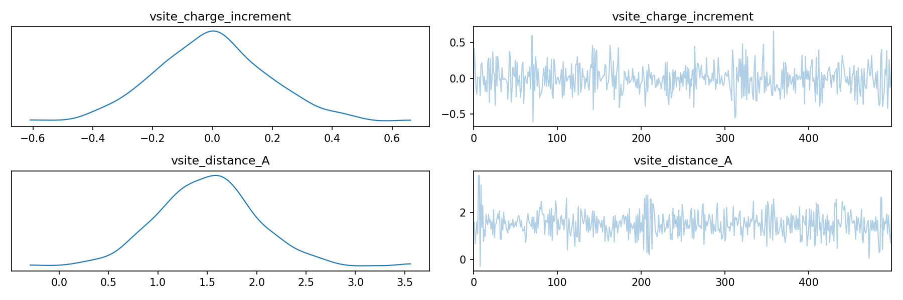

# Bayesian Virtual Site Fitting

Virtual sites are useful dummy charge-carrying particles that are not
constrained to atomic nuclei, allowing for additional positional
flexibility. Here, we implement a Bayesian virtual site fitting algorithm
using [Pyro](https://pyro.ai/) with the
[OpenFF Recharge virtual site formalism](https://docs.openforcefield.org/projects/recharge/en/stable/users/theory.html#virtual-sites).

The full runnable script is at `examples/tutorials/bayesian_vsite_fitting.py`.

## 1. Molecule, Conformer, and Multipoles

As in the previous examples, we generate a GDMA record for a molecule.
In this case, chloromethane.

```python
from openff.recharge.utilities.molecule import extract_conformers
from openff.toolkit import Molecule

from pympfit import GDMASettings, MoleculeGDMARecord, Psi4GDMAGenerator

molecule = Molecule.from_smiles("CCl")
molecule.generate_conformers(n_conformers=1)
[conformer] = extract_conformers(molecule)
settings = GDMASettings()
coords, multipoles = Psi4GDMAGenerator.generate(
    molecule, conformer, settings, minimize=True
)
record = MoleculeGDMARecord.from_molecule(molecule, coords, multipoles, settings)
```

## 2. Virtual Site Collection

We instantiate a `VirtualSiteCollection` object with placeholder
`charge_increments` and `distance` values. These will be sampled during
Bayesian inference.

```python
from openff.recharge.charges.vsite import BondChargeSiteParameter, VirtualSiteCollection

vsite_collection = VirtualSiteCollection(parameters=[
    BondChargeSiteParameter(
        smirks="[#17:1]-[#6:2]", name="EP", distance=0.0,
        charge_increments=(0.0, 0.0), sigma=0.0, epsilon=0.0, match="all-permutations",
    )
])
```

## 3. Objective Term

Next, create an objective term that specifies the vsite position being
constrained to somewhere along the C–Cl bond (`[#17:1]-[#6:2]`). The
`BondCharge` specification places the virtual site along the bond axis.

```python
from pympfit.optimize import MPFITObjective

[objective_term] = list(MPFITObjective.compute_objective_terms(
    gdma_records=[record],
    vsite_collection=vsite_collection,
    _vsite_charge_parameter_keys=[("[#17:1]-[#6:2]", "BondCharge", "EP", 0)],
    _vsite_coordinate_parameter_keys=[("[#17:1]-[#6:2]", "BondCharge", "EP", "distance")],
))
```

## 4. Bayesian Model and MCMC Sampling

Following standard Pyro recipes, we wrap a forward `model` function that
sets priors for trainable parameters. The model is then passed to the
MCMC NUTS algorithm for sampling.

```python
import numpy as np
import pyro
import pyro.distributions as dist
import torch
from pyro.infer import MCMC, NUTS

n_atoms = molecule.n_atoms
targets = [
    torch.from_numpy(r.astype(np.float64).flatten())
    for r in objective_term.reference_values
]


def model():
    # Priors
    free_charges = pyro.sample("free_charges", dist.Normal(
        torch.zeros(n_atoms - 1, 1, dtype=torch.float64), 0.5))
    charge_inc = pyro.sample("charge_inc", dist.Normal(
        torch.zeros(1, 1, dtype=torch.float64), 0.2))
    distance = pyro.sample("distance", dist.Normal(
        torch.tensor([[1.5]], dtype=torch.float64), 0.5))
    sigma = pyro.sample("sigma", dist.HalfCauchy(
        torch.tensor([[0.1]], dtype=torch.float64)))

    preds = objective_term.predict_from_free_charges(free_charges, charge_inc, distance)

    # Likelihood
    for i, (pred, target) in enumerate(zip(preds, targets)):
        pyro.sample(f"obs_{i}", dist.Normal(pred.flatten(), sigma), obs=target)


print("\nRunning NUTS (200 warmup, 500 samples)...")
mcmc = MCMC(NUTS(model), num_samples=500, warmup_steps=200, num_chains=1)
mcmc.run()
```

<details>
<summary>Example output (click to expand)</summary>

```text
Running NUTS (200 warmup, 500 samples)...
Warmup:   0%|    | 1/700 [00:00,  8.91it/s, step size=2.25e-01, acc. prob=1
...
Sample: 100%|██| 700/700 [00:24, 28.87it/s, step size=4.11e-01, acc. prob=0.933]

Atom charges:
  C1: -0.5736 +/- 0.3150
  Cl2: -0.5850 +/- 0.2218
  H3: +0.3084 +/- 0.3073
  H4: +0.3169 +/- 0.2937
  H5: +0.5332 +/- 0.3753

Vsite charge increment: -0.0041 +/- 0.1894
Vsite distance: 1.512 +/- 0.493 Å
```

</details>

## 5. Visualization

The distribution of the vsite's charge increment and position along the
bond can be visualized using ArviZ trace plots. The trace plot shows both
the sampling history (left) and posterior distribution (right).

```python
import arviz as az
import matplotlib.pyplot as plt

idata = az.from_pyro(mcmc, log_likelihood=False)

idata.posterior["vsite_charge_increment"] = idata.posterior["charge_inc"].squeeze()
idata.posterior["vsite_distance_A"] = idata.posterior["distance"].squeeze()

az.plot_trace(idata, var_names=["vsite_charge_increment", "vsite_distance_A"])
plt.tight_layout()
plt.savefig("bayesian_vsite_trace.png", dpi=150)
```



As can be seen, the distribution of the vsite's charge and position along
the bond results in a normally distributed posterior centered near the
prior means.
